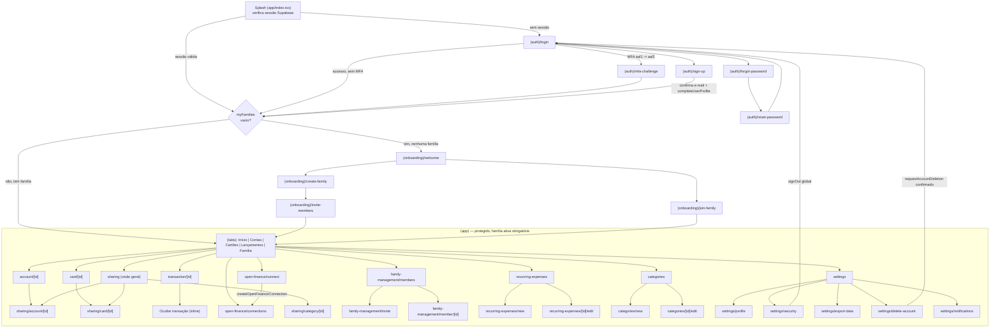

# Diagrama de navegação

Ver estrutura de pastas completa em [`00-overview.md`](./00-overview.md) e contratos por rota em [`routes/`](./routes/).

```mermaid
flowchart TD
    Splash["Splash (app/index.tsx)\nverifica sessão Supabase"]

    Splash -->|sem sessão| Login["(auth)/login"]
    Splash -->|sessão válida| CheckFamily{"myFamilies\nvazio?"}

    Login --> SignUp["(auth)/sign-up"]
    Login --> Forgot["(auth)/forgot-password"]
    Login -->|MFA aal1 -> aal2| MfaChallenge["(auth)/mfa-challenge"]
    Login -->|sucesso, sem MFA| CheckFamily
    MfaChallenge --> CheckFamily
    SignUp -->|confirma e-mail + completeUserProfile| CheckFamily
    Forgot --> ResetPassword["(auth)/reset-password"]
    ResetPassword --> Login

    CheckFamily -->|sim, nenhuma família| Welcome["(onboarding)/welcome"]
    CheckFamily -->|não, tem família| Tabs

    Welcome --> CreateFamily["(onboarding)/create-family"]
    Welcome --> JoinFamily["(onboarding)/join-family"]
    CreateFamily --> InviteMembers["(onboarding)/invite-members"]
    InviteMembers --> Tabs
    JoinFamily --> Tabs

    subgraph AppShell["(app) — protegido, família ativa obrigatória"]
        Tabs["(tabs): Início | Contas | Cartões | Lançamentos | Família"]

        Tabs --> AccountDetail["account/[id]"]
        Tabs --> CardDetail["card/[id]"]
        Tabs --> TransactionDetail["transaction/[id]"]
        Tabs --> FamilyMgmt["family-management/members"]

        AccountDetail --> SharingAccount["sharing/account/[id]"]
        CardDetail --> SharingCard["sharing/card/[id]"]
        TransactionDetail --> HideTx["Ocultar transação (inline)"]

        Tabs --> OFConnect["open-finance/connect"]
        Tabs --> OFConnections["open-finance/connections"]
        OFConnect -->|createOpenFinanceConnection| OFConnections

        Tabs --> Sharing["sharing (visão geral)"]
        Sharing --> SharingAccount
        Sharing --> SharingCard
        Sharing --> SharingCategory["sharing/category/[id]"]

        FamilyMgmt --> InviteMember["family-management/invite"]
        FamilyMgmt --> MemberDetail["family-management/member/[id]"]

        Tabs --> RecurringList["recurring-expenses"]
        RecurringList --> RecurringNew["recurring-expenses/new"]
        RecurringList --> RecurringEdit["recurring-expenses/[id]/edit"]

        Tabs --> CategoriesList["categories"]
        CategoriesList --> CategoryNew["categories/new"]
        CategoriesList --> CategoryEdit["categories/[id]/edit"]

        Tabs --> Settings["settings"]
        Settings --> Profile["settings/profile"]
        Settings --> Security["settings/security"]
        Settings --> ExportData["settings/export-data"]
        Settings --> DeleteAccount["settings/delete-account"]
        Settings --> Notifications["settings/notifications"]
    end

    Security -->|signOut global| Login
    DeleteAccount -->|requestAccountDeletion confirmado| Login
```
